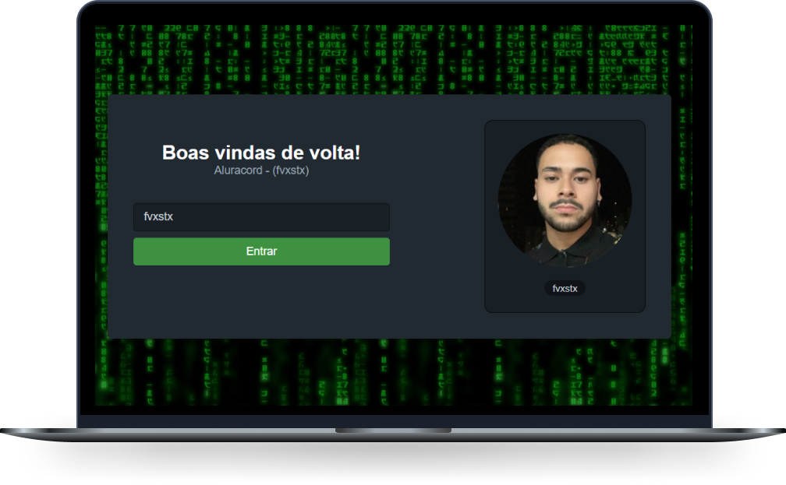

  

 

  <a href="#-acesso">Acesso</a>&nbsp;&nbsp;&nbsp;|&nbsp;&nbsp;&nbsp;
  <a href="#-tecnologias">Tecnologias</a>&nbsp;&nbsp;&nbsp;|&nbsp;&nbsp;&nbsp;
  <a href="#-projeto">Projeto</a>&nbsp;&nbsp;&nbsp;|&nbsp;&nbsp;&nbsp;
  <a href="#-layout">Layout</a>&nbsp;&nbsp;&nbsp;|&nbsp;&nbsp;&nbsp;
  <a href="#memo-licença">Licença</a>&nbsp;&nbsp;&nbsp;|&nbsp;&nbsp;&nbsp;
  <a href="#-comandos">Comandos</a>

## 😁 Acesso

Acesse e veja você mesmo: https://aluracord-bay-gamma.vercel.app/

## 🚀 Tecnologias

Esse projeto foi desenvolvido com as seguintes tecnologias:

- [Javascript](https://developer.mozilla.org/pt-BR/docs/Web/JavaScript)
- [Node.js](https://nodejs.org/en/)
- [React.js](https://reactjs.org/)
- [Next.js](https://nextjs.org/)
- [Supabase](https://supabase.com/)
- [Skynexui](https://github.com/skynexui/components)

## 💻 Projeto

O Aluracord é um chat com mensagens em tempo real que você acessa com seu usuario do github.

## 🔖 Layout

Você pode visualizar o layout do projeto através [desse link](https://www.figma.com/file/X5kVg1hNCajiV73ah7iyPz/Imers%C3%A3o-React---Aluracord---Matrix). Lembrando que você precisa ter uma conta no [Figma](http://figma.com/) para acessá-lo.

## :memo: Licença

Esse projeto está sob a licença MIT. Veja o arquivo [LICENSE](LICENSE.md) para mais detalhes.

## 🧮 Comandos

Para iniciar o projeto em modo desenvolvedor você utiliza o comando

### `yarn dev`

Abre o projeto nesse link [http://localhost:3000](http://localhost:3000) para ver no seu browers.

Está pagina reinicia a cada mudança feita

### `yarn build`

Cria uma versão da sua aplicação otimizada para modo produção

### `yarn start`

Inicia o projeto em modo produção

### `yarn lint`

Inicia o ESLint nos arquivos para previnir erros e encontrar problemas

---
